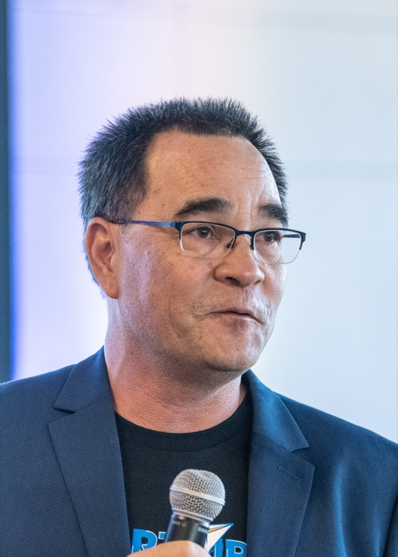

# Be the Answer

Materials for the **Be the Answer** workshop — slides, handouts, prompts, skills, and MCP server references. Everything here is public: clone it, copy it, remix it.

> ### 👉 New here? **[Start Here](handouts/start-here.md)** — the 5-minute recap + everything you need to be the answer, free.

## 📊 Slides

The presentation lives in [`slides/`](slides/) and is built with [reveal.js](https://revealjs.com/).

- **Present live:** open the [published slides](https://mashley.github.io/be-the-answer/) fullscreen on a laptop or iPad.
- **Present locally:** open `slides/index.html` in any browser and press `F` for fullscreen.
- **Navigate:** arrow keys or swipe. Press `S` for speaker notes, `Esc` for the slide overview.

## 📁 What's in here

| Folder | What it holds |
|---|---|
| [`slides/`](slides/) | The reveal.js presentation |
| [`handouts/`](handouts/) | One Markdown file per teachable moment — take-home, ready to recreate |
| [`prompts/`](prompts/) | Reusable prompts demoed in the workshop |
| [`skills/`](skills/) | Claude skills shown in the workshop |
| [`mcp-servers/`](mcp-servers/) | Notes and links for the MCP servers referenced |
| [`resources.md`](resources.md) | Curated links |
| `local/` | **Not in the repo** — personal, machine-only notes (gitignored) |

## 🌐 Enable the live slides (one-time setup)

1. Push this repo to GitHub.
2. Repo **Settings → Pages → Build and deployment → Source: Deploy from a branch**.
3. Branch: **main**, folder: **/ (root)**. Save.
4. After a minute, your slides are live at `https://<your-username>.github.io/<repo-name>/`.

The root of the site redirects to the deck automatically.

## 👤 About Michael

**Michael "Mash" Ashley** — founder, advisor, and educator. He built and sold **FastPencil** (the first online self-publishing platform, before the Kindle), and has since been a trusted advisor inside three more exits — a private-equity sale, an acquisition by F5, and an IPO. He's an adjunct professor at San José State University, host of the **Inspiring Founders** peer groups, and founder & CEO of **Radi8**.

🌐 [mashley.com](https://mashley.com) · [inspiringfounders.com](https://inspiringfounders.com) · [radi8.com](https://radi8.com) · [LinkedIn](https://www.linkedin.com/in/mashley/)

 

## 📄 License

Licensed under [CC BY 4.0](LICENSE) — use anything here freely, just credit Michael Ashley.
